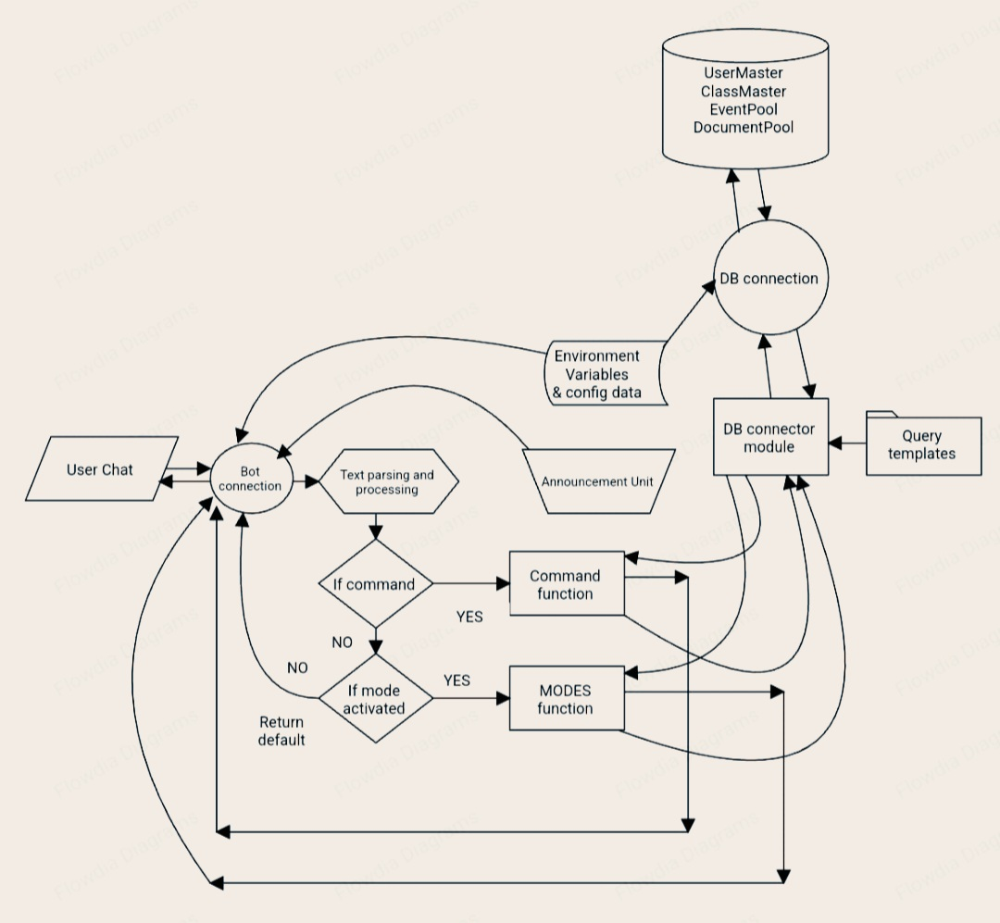

# DESIGN AND STRUCTURE

## Table of Contents

1. [Design Pattern](#design-pattern)
2. [Design Principles](#design-principles)
  - 1. [Single Responsibility Principle (SRP)](#single-responsibility-principle-srp)
  - 2. [Separation of Concerns (SoC)](#separation-of-concerns-soc)
  - 3. [Open/Closed Principle (OCP)](#openclosed-principle-ocp)
  - 4. [Don't Repeat Yourself (DRY)](#dont-repeat-yourself-dry)
  - 5. [Documentation and Comments](#documentation-and-comments)
3. [Flow Diagram](#flow-diagram)
---

## Design Pattern

This open-source project follows a unique design pattern tailored specifically for its development cycle. To delve deeper into the intricacies of the design pattern used in this project, please refer to [Design Principles](#design-principles). This section will provide you with detailed insights into the specific configuration of the [SOLID](https://en.wikipedia.org/wiki/SOLID) design pattern applied in this project's development.

### Other Essential Articles

- **[README.md](../README.md):** Explore this file for comprehensive project-related information.
- **[CONTRIBUTING.md](CONTRIBUTING.md):** Learn about the procedures and guidelines for contributing to this project.
- **[CODE_OF_CONDUCT.md](CODE_OF_CONDUCT.md):** Familiarize yourself with the community guidelines and expected code of conduct.
- **[STYLE_GUIDELINES.md](STYLE_GUIDELINES.md):** Discover the coding style and conventions used in this project.

For a detailed understanding of the specific configuration of the [SOLID](https://en.wikipedia.org/wiki/SOLID) design pattern utilized in this project, please continue reading in the [Design Principles](#design-principles) section.

## Design Principles

### 1. **Single Responsibility Principle (SRP):**
- **Explanation:** Each class or module has a single responsibility, such as handling commands, messages, errors, or configuration.
- **Application:** Breaking down functionality into separate classes or modules ensures that each one has a specific purpose, adhering to the SRP.

### 2. **Separation of Concerns (SoC):**
- **Explanation:** Dividing a system into distinct sections, where each section addresses a separate concern.
- **Application:** Each module (commands, messages, errors, configuration) focuses on a specific concern, adhering to the SoC principle. For example, the `CommandHandler` class handles only command-related concerns.

### 3. **Open/Closed Principle (OCP):**
- **Explanation:** Modules are open for extension (new features can be added by creating new modules) but closed for modification (existing modules do not need to be modified).
- **Application:** By creating new modules for different functionalities (commands, messages, errors), you can extend the application without modifying existing modules, following the OCP.

### 4. **Don't Repeat Yourself (DRY):**
- **Explanation:** Avoiding code duplication and promoting code reuse.
- **Application:** By separating concerns into modules and reusing these modules where needed (e.g., importing `CommandHandler` and `MessageHandler`), the codebase avoids duplication, following the DRY principle.

### 5. **Documentation and Comments:**
- **Explanation:** Clearly documenting code to make it understandable and maintainable.
- **Application:** Adding docstrings and comments to functions and classes ensures that the codebase is well-documented, making it easier for developers to understand and maintain the code.

## Flow Diagram

This flow diagram delineates the program's flow, providing a conceptual overview. It does not elucidate the intricacies of the actual code structure but rather presents a logical representation of the program's flow.

---
© 2023 AVIRAJ SAHA & MAITHIL SAHA. THIS OPEN-SOURCE SOFTWARE IS LICENSED UNDER THE [GPLv3.0](../LICENCE).